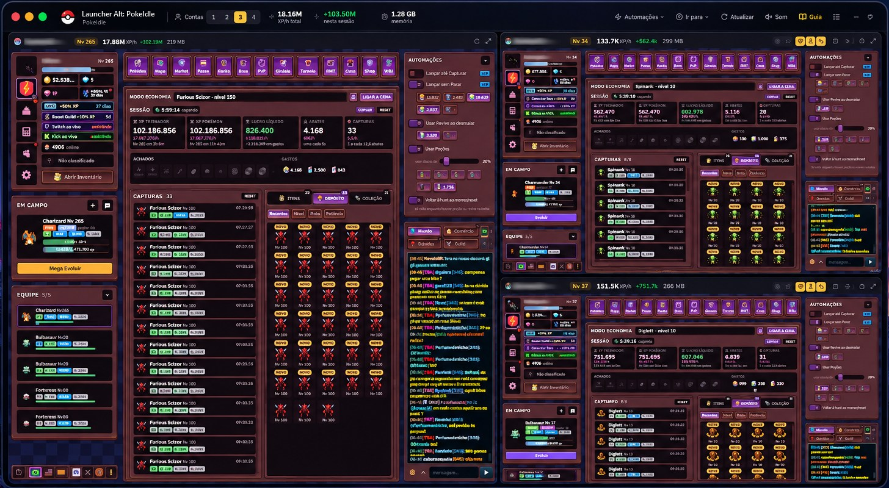
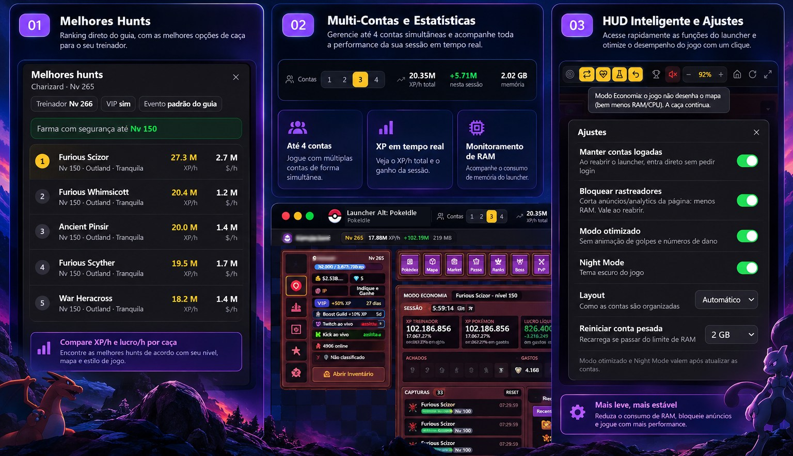
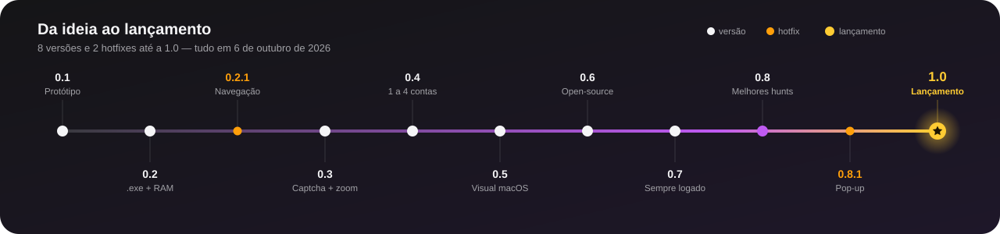
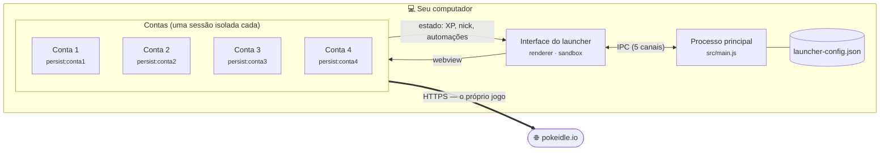

<p align="center">
  
</p>

<p align="center">
  
  
  
  
  
</p>

<p align="center">
  <a href="#-download">Download</a> ·
  <a href="#-funcionalidades">Funcionalidades</a> ·
  <a href="#-da-ideia-ao-lançamento">Versões</a> ·
  <a href="#-segurança-e-privacidade">Segurança</a> ·
  <a href="#-como-funciona-por-dentro">Como funciona</a> ·
  <a href="#-compilar-a-partir-do-código">Compilar</a> ·
  <a href="#-perguntas-frequentes">FAQ</a> ·
  <a href="#-apoie-o-projeto">Apoie</a>
</p>

---

O **Pokéidle.io** permite jogar com até **4 contas** — normalmente uma principal e três alts para farmar. Fazer isso no navegador significa quatro perfis diferentes, quatro janelas e nenhuma visão geral.

O **Launcher Alt: PokeIdle** junta tudo em **uma única janela**: cada conta roda isolada no seu próprio card, você vê o XP/h de todas ao mesmo tempo, liga automações em todas com um clique e acompanha quanta memória cada uma está usando.

> **Tudo roda no seu computador.** O launcher não tem servidor, não coleta dados, não envia nada para lugar nenhum e não toca na sua senha. O código está todo aqui para você conferir.

<p align="center">
  
  <br>
  <sub>3 contas farmando lado a lado — a principal em destaque, XP/h total, XP da sessão e memória sempre à vista.</sub>
</p>

## ✨ Funcionalidades

<p align="center">
  
  <br>
  <sub><b>01</b> Melhores hunts direto do guia · <b>02</b> Multi-contas e estatísticas em tempo real · <b>03</b> HUD inteligente e ajustes de desempenho</sub>
</p>

| | |
|---|---|
| **1 a 4 contas** | Escolha quantas contas rodar no seletor do topo. Contas desligadas não abrem e não usam memória. |
| **Contas isoladas** | Cada conta tem sua própria sessão (como um perfil de navegador separado). |
| **Sempre logado** | Logou uma vez, fechou o launcher, abriu no dia seguinte: as contas entram direto, sem pedir login. Se o jogo descartar a sessão por uma falha passageira na abertura, o launcher a devolve sozinho. |
| **Abertura escalonada** | Ao abrir, as contas entram uma a cada 3 segundos, em vez de todas juntas — menos pico de CPU/RAM e menos falhas de captcha. |
| **Captcha que se recupera** | Se aparecer "Não deu para confirmar que você não é um robô", a conta é recarregada sozinha (até 3 vezes em 5 min). |
| **Layout inteligente** | 2×2 com 4 contas, principal em destaque com 3, lado a lado com 2. Também há "lado a lado" e "empilhado". |
| **Zoom automático** | O jogo se ajusta sozinho ao tamanho de cada card, com a HUD inteira visível. Dá para ajustar à mão por conta. |
| **Melhores hunts** 🏆 | Abra a ficha do seu pokémon no jogo (botão **"i"**) e clique no troféu do card: o launcher mostra o **top 5 de hunts** e até que nível você farma com segurança, usando a calculadora do [Guia HardToCapture](https://guiapokeidlehardtocapture.site/) com seu nível de treinador, VIP e evento preenchidos sozinhos. |
| **XP/h em tempo real** | Por conta e somado, calculado sobre os últimos 10 minutos, mais o XP ganho na sessão. |
| **Automações** | Liga/desliga *Lançar até capturar*, *Lançar sem parar*, *Revive*, *Poções* e *Voltar à hunt* — por conta ou em todas de uma vez. O launcher lembra suas escolhas e as reaplica quando a conta loga. |
| **Ir para** | Abre Mapa, Market, Boss, Pokédex etc. em todas as contas (ou só na que está em foco). |
| **Modo otimizado e Night Mode** | Ficam sempre ligados em todas as contas (pode desligar nos Ajustes). |
| **Modo Economia por conta** | Um clique no ícone de folha faz o jogo parar de desenhar o mapa naquela conta — a caça continua e o consumo de RAM/CPU cai bastante. Ideal para alts. |
| **Monitor de memória** | RAM total e por conta, com reinício automático opcional de uma conta que passar do limite. |
| **Bloqueio de rastreadores** | Corta os scripts de anúncio/analytics que a página carrega (Google Analytics, Tag Manager, Pixel do Facebook): menos RAM e mais privacidade. |
| **Mudo de verdade** | Conta no mudo desliga o som dentro do jogo, que deixa de tocar e decodificar áudio. |
| **Foco** | Expanda uma conta para a janela inteira; as outras continuam farmando. |
| **À prova de queda** | Se o jogo de uma conta travar, só aquele card recarrega sozinho (com login e automações). O modo "pop-up" do jogo (Picture-in-Picture) fica desligado no launcher, porque derrubava a janela; no lugar dele o jogo mostra o cartão dentro da página. |
| **Nomes salvos** | Renomeie cada card com o nick da conta; se deixar o nome padrão, o launcher usa o nick do jogo. |

## 🚀 Da ideia ao lançamento

<p align="center">
  
</p>

O launcher nasceu de uma ideia simples — *"e se as 4 contas coubessem numa janela só?"* — e foi lapidado versão a versão, testado de verdade no farm, até chegar à 1.0. Cada etapa:

<details open>
<summary><b>⭐ 1.0 — Lançamento</b> · a versão pública</summary>

<br>

Tudo o que veio antes, reunido numa versão só — com a base testada numa **noite inteira de farm sem parar**. Código aberto, executável portátil gerado pelo GitHub Actions e documentação completa de segurança e privacidade.
</details>

<details>
<summary><b>🩹 0.8.1 — Hotfix: pop-up</b> · nada de janela caindo</summary>

<br>

- O botão de **pop-up** do jogo (Picture-in-Picture) derrubava o launcher. Agora ele fica desligado e o jogo usa o cartão dentro da própria página.
- **À prova de queda:** se o jogo de uma conta travar, só aquele card recarrega sozinho — as outras seguem farmando.
</details>

<details>
<summary><b>🏆 0.8 — Melhores hunts</b> · o guia dentro do launcher</summary>

<br>

- Abriu a ficha do pokémon no jogo? Um clique no troféu mostra o **top 5 de hunts** e até que nível você farma com segurança.
- Usa a calculadora do Guia HardToCapture ao vivo, com nível do treinador, VIP e evento preenchidos sozinhos — e fecha o guia logo depois para não ocupar memória.
</details>

<details>
<summary><b>🔐 0.7 — Sempre logado</b> · fechou, abriu, já está jogando</summary>

<br>

- As contas **continuam logadas** entre aberturas, mesmo quando o jogo descarta a sessão por uma falha passageira.
- **Abertura escalonada** (uma conta a cada 3 s) e **captcha que se recupera** sozinho.
- **Rastreadores bloqueados** e **mudo de verdade**: menos RAM, mais privacidade.
</details>

<details>
<summary><b>📦 0.6 — Open-source</b> · pronto para o GitHub</summary>

<br>

- Código organizado em `src/`, **Electron 44** e o checklist de segurança do Electron aplicado (sandbox, validação de webviews, permissões negadas, CSP).
- README, licença MIT, política de segurança e build automático no GitHub Actions.
</details>

<details>
<summary><b>🎨 0.5 — Visual macOS</b> · clean, fluido e didático</summary>

<br>

- Ícones vetoriais no lugar de emojis, barra de título integrada, seletor de contas deslizante, switches no estilo iOS.
- Dicas ao passar o mouse e avisos discretos a cada ação.
</details>

<details>
<summary><b>🎛️ 0.4 — De 1 a 4 contas</b> · rode só o que precisa</summary>

<br>

- Escolha quantas contas rodar; contas desligadas **não usam memória**. Com 3, a principal ganha destaque.
- **Modo otimizado** e **Night Mode** sempre ligados, **Modo Economia** por conta e nomes salvos (com o nick do jogo).
</details>

<details>
<summary><b>🔍 0.3 — Captcha e zoom automático</b> · login funcionando e HUD inteira</summary>

<br>

- O captcha da Cloudflare passou a aceitar o login dentro do launcher.
- **Zoom automático**: o jogo se ajusta a cada card com a HUD inteira visível.
- XP ganho na sessão e botão do guia.
</details>

<details>
<summary><b>🩹 0.2.1 — Hotfix: navegação</b> · sem ficar preso fora do jogo</summary>

<br>

- Clicar em "Login com Google" prendia o card numa página sem volta. Agora cada conta fica **travada no Pokéidle**, e o botão **início** sempre traz o jogo de volta.
</details>

<details>
<summary><b>🧠 0.2 — Executável e RAM</b> · leve de verdade</summary>

<br>

- Primeiro **`.exe` portátil**, com o logo da pokébola e o nome *Launcher Alt: PokeIdle*.
- Gestão de memória: Chromium em modo econômico, farm que não pausa minimizado, monitor de RAM e reinício automático de conta pesada.
</details>

<details>
<summary><b>🌱 0.1 — Protótipo</b> · onde tudo começou</summary>

<br>

- 4 contas em sessões isoladas numa grade 2×2, zoom por painel, XP/h por conta e controle das 5 automações do jogo.
</details>

Detalhes técnicos de cada versão no [CHANGELOG](CHANGELOG.md).

## 📥 Download

1. Vá em [**Releases**](../../releases) e baixe `Launcher Alt - PokeIdle.exe`.
2. Dê dois cliques. Não precisa instalar — é um executável portátil.
3. Faça login em cada card com **e-mail/usuário e senha** do Pokéidle.

> **Aviso do Windows SmartScreen:** como o executável não é assinado com um certificado pago, o Windows pode mostrar "O Windows protegeu o computador". Clique em **Mais informações → Executar assim mesmo**. Se preferir não confiar no binário, [compile você mesmo](#-compilar-a-partir-do-código) — dá o mesmo resultado.

**Conferindo o arquivo:** cada release traz o hash SHA-256 do `.exe`. Para comparar, no PowerShell:

```powershell
Get-FileHash ".\Launcher Alt - PokeIdle.exe" -Algorithm SHA256
```

Os executáveis das releases são gerados pelo [GitHub Actions](.github/workflows/release.yml) a partir deste código, então qualquer pessoa pode ver exatamente como foram construídos.

## 🔒 Segurança e privacidade

### Resumo

- **100% local.** Não existe servidor do launcher. Sem telemetria, sem analytics, sem anúncios, sem atualização automática.
- **O launcher não tem servidor próprio.** Quem acessa a internet é a página do jogo dentro de cada card — exatamente o que aconteceria no seu navegador — e, só quando você pede **Melhores hunts**, a página do guia.
- **Sua senha nunca passa pelo launcher.** Você digita o login direto na página oficial do jogo. O código não lê campos de e-mail ou senha, e não guarda credenciais.
- **Código aberto e pequeno.** São cerca de 1.400 linhas em HTML/CSS/JavaScript puro, sem frameworks e **sem nenhuma dependência em tempo de execução** além do próprio Electron.

### Com o que o launcher conversa

| Destino | Quem acessa | Para quê |
|---|---|---|
| `pokeidle.io` | A página do jogo dentro de cada card | Jogar, como no navegador |
| Serviços que a página do jogo carrega (ex.: captcha Cloudflare Turnstile) | A página do jogo | Login e funcionamento normal do jogo |
| `guiapokeidlehardtocapture.site` | Uma página escondida, aberta só quando você clica em **Melhores hunts** e fechada logo depois | Calcular as hunts. A ficha é colada na calculadora da página, que roda no seu computador — conferimos que a ficha **não** é enviada ao servidor do guia (a página só faz um ping de "usuários online"). Essa sessão é separada e não tem acesso às suas contas |
| Botão Guia e links externos | **Seu navegador padrão** | Abrem fora do launcher |
| Google Analytics, Google Tag Manager, DoubleClick, Pixel do Facebook | Ninguém — **bloqueados** por padrão | São rastreadores que a página do jogo carrega; não fazem parte da jogabilidade. Dá para desligar o bloqueio nos Ajustes |

Nenhum card consegue sair do Pokéidle: qualquer navegação para outro site é bloqueada, e links externos vão para o seu navegador.

### O que o launcher **lê** da página do jogo

Só estes elementos, a cada 2 segundos ([`src/preload/game-preload.js`](src/preload/game-preload.js)):

| Elemento | Usado para |
|---|---|
| `#tr-xp-txt` (XP do treinador) | Calcular XP/h e XP da sessão |
| `#tr-nick`, `#tr-level` | Mostrar nick e nível no card |
| `#tr-gold` | Exibir ouro |
| `#auto-ball-captura`, `#auto-ball-sem-parar`, `#auto-revive`, `#auto-potion`, `#auto-voltar-hunt` | Saber se cada automação está ligada |
| visibilidade de `#login` | Saber se a conta está logada |
| `#tr-ativos` (bônus ativos) e o banner "EVENTO! +N% XP" | Saber se há VIP e evento, para a conta das Melhores hunts |
| A ficha do pokémon, **só quando você a abre** (tela com Stats atuais e Stats-base) | Melhores hunts — é o mesmo texto que você copiaria com Ctrl+A / Ctrl+C para colar no guia |

Esses dados vão apenas da página para a interface do launcher, na sua máquina.

### O que o launcher **faz** na página do jogo

| Ação | Quando |
|---|---|
| Grava `cfg-otimizado`, `cfg-night`, `cfg-economia` e `cfg-som` no armazenamento local do jogo | Ao carregar a conta e quando você muda o mudo/economia, conforme seus Ajustes (as mesmas chaves que o menu de Configurações do jogo usa) |
| Guarda uma cópia da sessão do jogo (`sessao` → `__launcher_sessao`) | Enquanto a conta está logada, para devolvê-la se o jogo a descartar por falha passageira na abertura. Fica no mesmo armazenamento da conta, no seu PC. Se você clicar em **Sair** no jogo, a cópia é apagada e o launcher não reloga sozinho |
| Recarrega a conta | Quando o captcha falha ou a sessão precisa ser devolvida (no máximo 3 vezes a cada 5 min) |
| Clica nas caixas de automação do próprio jogo | Só quando você liga/desliga uma automação, ou ao logar, para reaplicar o que você escolheu |
| Clica nos botões de aba (Mapa, Market...) | Só quando você usa "Ir para" |

O launcher **não** joga por você: ele só aciona opções que já existem na interface do jogo.

### Como o código é protegido

Seguindo o [checklist de segurança do Electron](https://www.electronjs.org/docs/latest/tutorial/security):

- `contextIsolation` ligado, `nodeIntegration` desligado e **sandbox** ativa na interface e em todas as contas.
- Todo `<webview>` é validado pelo processo principal (`will-attach-webview`): só é criado se for o jogo (`https://pokeidle.io`, em uma das 4 partições de conta, com o preload do launcher) ou o guia (`https://guiapokeidlehardtocapture.site`, em uma partição própria e **sem** preload). Cada um fica travado no próprio site.
- A interface do launcher não navega nem abre janelas; uma **Content-Security-Policy** restritiva (`default-src 'none'`) bloqueia scripts e conteúdos externos.
- Permissões sensíveis (câmera, microfone, localização, notificações etc.) são **negadas**; só tela cheia e cópia para a área de transferência são permitidas.
- A ponte entre interface e sistema expõe só **5 canais IPC**: carregar/salvar configuração, abrir link https no navegador, ler uso de memória e ler preferências do jogo.
- Apenas uma instância do launcher roda por vez.

**Sobre o user-agent:** com a identificação padrão do Electron, o captcha da Cloudflare recusa o login. Por isso cada conta se apresenta como um Chrome comum da mesma versão do Chromium embutido. Isso é feito às claras em [`src/main.js`](src/main.js).

### Onde ficam os seus dados

Tudo em `%APPDATA%\Launcher Alt - PokeIdle\`:

| Caminho | Conteúdo |
|---|---|
| `launcher-config.json` | Nomes dos cards, zoom, quantidade de contas, automações escolhidas e ajustes |
| `Partitions\conta1` … `conta4` | Sessão de cada conta (cookies e dados do site, incluindo o token de login que o próprio jogo guarda e a cópia de segurança dele), igual a um perfil de navegador |

> O token de login fica no seu disco, como acontece em qualquer navegador com "manter conectado". Quem tiver acesso à sua conta do Windows poderia usá-lo. Em um PC compartilhado, desligue **Manter contas logadas** nos Ajustes ou clique em **Sair** no jogo ao terminar.

Exemplo do `launcher-config.json`:

```json
{
  "count": 3,
  "layout": "auto",
  "ramLimit": 2000,
  "forceOtim": true,
  "forceNight": true,
  "keepLogin": true,
  "blockTrackers": true,
  "accounts": [
    { "name": "MeuNick", "zoom": null, "desired": { "auto-potion": true }, "eco": false, "muted": true }
  ]
}
```

**Para apagar tudo** (sair de todas as contas e zerar as configurações): feche o launcher e apague essa pasta.

## 🧠 Como funciona por dentro



| Arquivo | Papel |
|---|---|
| [`src/main.js`](src/main.js) | Processo principal: janela, sessões isoladas, regras de segurança, configuração, medição de RAM e economia de recursos |
| [`src/preload/ui-preload.js`](src/preload/ui-preload.js) | Ponte mínima (4 funções) entre a interface e o processo principal |
| [`src/preload/game-preload.js`](src/preload/game-preload.js) | Roda dentro de cada conta: aplica preferências do jogo, mantém a conta logada, recupera o captcha e informa XP, nick, nível e automações |
| [`src/renderer/renderer.js`](src/renderer/renderer.js) | Interface: cards, XP/h, automações, "Ir para", zoom automático, RAM e ajustes |
| [`src/renderer/index.html`](src/renderer/index.html) · [`style.css`](src/renderer/style.css) | Estrutura e visual |
| [`src/renderer/hunts.js`](src/renderer/hunts.js) | Melhores hunts: consulta a calculadora do guia escondida e mostra o top 5 |
| [`src/renderer/icons.js`](src/renderer/icons.js) | Ícones vetoriais (traço, estilo Lucide) |

### Melhores hunts

1. Você abre a ficha de um pokémon no jogo (botão **"i"**). O launcher guarda o texto dela.
2. Ao clicar no troféu do card, ele abre o Guia HardToCapture **escondido**, cola a ficha na aba *Onde caçar*, preenche nível do treinador, VIP e evento e lê a tabela.
3. Mostra o top 5 (XP/h, dinheiro/h, nível, região) e até que nível o pokémon farma com segurança — e **fecha o guia**, devolvendo a memória.

Os números são **sempre os do guia**: quando o guia ou o jogo mudam, o resultado acompanha, sem precisar atualizar o launcher. O resultado fica guardado por 30 min (ou até a ficha ou o nível mudarem). Se um dia o guia mudar de formato e a leitura falhar, o launcher avisa e oferece abrir o guia no navegador.

### Cálculo do XP/h

O launcher lê o texto `atual / máximo xp` do treinador a cada 2 s e soma as diferenças. Quando o treinador sobe de nível (o valor atual "zera"), ele soma o que faltava para o nível anterior mais o novo valor. O XP/h é a inclinação dessa soma nos últimos 10 minutos — por isso leva uns 30 s para aparecer.

### Gestão de memória

Rodar quatro jogos ao mesmo tempo pesa. O launcher atua em várias frentes:

- **Contas desligadas não existem:** reduzir de 4 para 3 contas encerra o processo da 4ª e libera a memória na hora.
- **Abertura escalonada:** as contas abrem uma a cada 3 s, evitando o pico de tudo carregando junto.
- **Chromium em modo econômico** (`enable-low-end-device-mode`) e limite de heap JavaScript de 1 GB por conta.
- **Modo otimizado** sempre ligado e **Modo Economia** opcional por conta.
- **Rastreadores bloqueados:** nos testes com 4 contas abertas, cerca de 70 MB (~5%) a menos de memória privada só na tela de login; com as contas jogando, os rastreadores trabalham mais e a economia tende a crescer.
- **Mudo de verdade:** conta no mudo desliga o som do jogo, que deixa de carregar e tocar áudio.
- **Cache HTTP limpo a cada 30 min** (sem apagar login).
- **Recursos desnecessários do Chromium desligados:** tradução, transmissão de mídia, autofill, cache de páginas anteriores (back-forward cache) e corretor ortográfico.
- **Reinício automático** opcional de uma conta que passe do limite de RAM escolhido (o login e as automações voltam sozinhos).
- **O farm não para minimizado:** a limitação de timers em segundo plano do Chromium é desligada, para o jogo seguir no ritmo normal mesmo com a janela minimizada ou coberta.

## 🛠️ Compilar a partir do código

Pré-requisitos: **Windows 10/11** e **[Node.js](https://nodejs.org) 20 ou mais novo**.

```powershell
git clone https://github.com/henriquecodo/launcher-alt-pokeidle.git
cd launcher-alt-pokeidle
npm ci

# rodar em modo desenvolvimento
npm start

# gerar o executável portátil em dist\
npm run dist
```

**Tecnologias:** [Electron](https://www.electronjs.org/) (Chromium + Node.js), [electron-builder](https://www.electron.build/) para empacotar, HTML/CSS/JavaScript puro na interface e ícones no estilo [Lucide](https://lucide.dev) (licença ISC).

## ❓ Perguntas frequentes

<details>
<summary><b>Posso logar com Google ou Discord?</b></summary>

Não. O Google bloqueia login dentro de aplicativos embutidos, e o launcher impede que o card saia do Pokéidle. Use e-mail/usuário e senha.
</details>

<details>
<summary><b>Melhores hunts diz "abra a ficha do seu pokémon". Como?</b></summary>

No jogo, clique no **"i"** ao lado do pokémon (a tela com *Stats atuais* e *Stats-base da espécie*). O launcher lê sozinho e avisa "ficha lida". Trocou de pokémon ou ele subiu muito de nível? Abra a ficha de novo.
</details>

<details>
<summary><b>Preciso logar toda vez que abro o launcher?</b></summary>

Não. Com **Manter contas logadas** ligado (padrão), você loga uma vez e as contas entram direto nas próximas aberturas. Se ainda assim uma conta pedir login, o token pode ter expirado no servidor do jogo — é só logar de novo.
</details>

<details>
<summary><b>O captcha não carregou. E agora?</b></summary>

O launcher tenta resolver sozinho, recarregando a conta quando o captcha falha. Se não resolver, use o botão **Recarregar** do card (seta circular).
</details>

<details>
<summary><b>Por que no máximo 4 contas?</b></summary>

É o limite permitido pelo próprio Pokéidle (uma principal e até três alts).
</details>

<details>
<summary><b>O farm continua com o launcher minimizado?</b></summary>

Sim. O launcher desliga a pausa de segundo plano do Chromium para isso. Só não feche a janela.
</details>

<details>
<summary><b>O antivírus reclamou. É vírus?</b></summary>

Executáveis novos e sem assinatura digital às vezes geram alertas genéricos. Você pode conferir o hash SHA-256 da release, ver o build no GitHub Actions ou compilar você mesmo a partir deste código.
</details>

<details>
<summary><b>Como saio de uma conta?</b></summary>

Pelo próprio menu do jogo, dentro do card. Para apagar tudo de uma vez, feche o launcher e apague a pasta `%APPDATA%\Launcher Alt - PokeIdle\`.
</details>

## 🤝 Contribuindo

Sugestões e correções são bem-vindas! Abra uma [issue](../../issues) descrevendo a ideia ou o problema, ou envie um pull request. Para falhas de segurança, veja [SECURITY.md](SECURITY.md).

## ⚖️ Aviso legal

Este é um projeto de fã, gratuito e sem fins lucrativos. **Não tem vínculo** com o Pokéidle.io, nem com a Nintendo, Game Freak, Creatures Inc. ou The Pokémon Company. Pokémon e os nomes relacionados são marcas registradas de seus respectivos donos. Use o launcher de acordo com as regras do jogo.

## 📄 Licença

[MIT](LICENSE) — use, estude, modifique e distribua à vontade. Avisos de terceiros em [THIRD_PARTY_NOTICES.md](THIRD_PARTY_NOTICES.md).

## 💛 Apoie o projeto

O Launcher Alt: PokeIdle é e continuará sendo **gratuito e open-source**. Se ele te ajudou a farmar e você quiser apoiar o desenvolvimento, qualquer contribuição é muito bem-vinda — e totalmente opcional.

> 🎮 **Para onde vai o apoio:** sempre que houver tempo, toda contribuição recebida retornará em **depósitos dentro do próprio Pokéidle.io**, contribuindo também com o jogo que a gente joga.

<table>
<tr>
<td align="center" width="260" valign="top">
  <br><br>
  <br>
  <sub>Aponte a câmera do app do seu banco</sub><br><br>
  <b>Chave Pix (CNPJ)</b><br>
  <code>69095091000192</code>
</td>
<td valign="top">

**Criptomoedas**


```text
91yp2p6P6DEsq42h6g7TSfeyzCJKCauvcGM3NadBumjD
```


```text
0xc83dbd7ffbe4bf92f0c6e1391b1b1592aaf12cd5
```


```text
G1mFuGp9iSK6m7Y2fvxjsdUxr2PWYB1FjHgv175N72GD
```

</td>
</tr>
</table>

<sub>⚠️ Em cripto, **confira a rede antes de enviar**: SOL e USDT na rede **Solana**, ETH na rede **Ethereum**. Enviar pela rede errada pode perder o valor para sempre. E sempre compare o endereço com o deste repositório oficial. Obrigado pelo apoio! 💛</sub>
